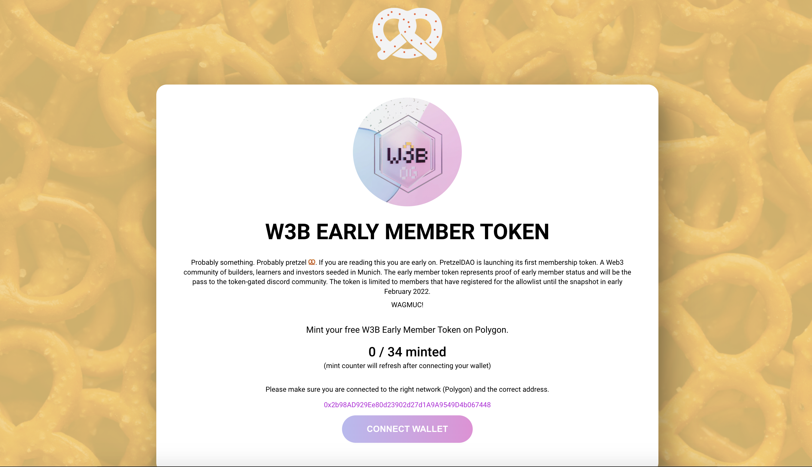

# W3B OG Token Mint Page

This is a basic front-end implementation for the minting dapp of the Munich Web3 Builder Early Member Token based on react.js and web3.js.



## Installation 🛠️

If you are cloning the project then run this first, otherwise you can download the source code on the release page and skip this step.

```sh
git clone git@github.com:MunichWeb3Builders/MINT_PAGE_SUGGESTION_1.git
```

Make sure you have node.js installed so you can use npm, then run:

```sh
npm install
```

## Run 🚀

```sh
npm run start
```

Or create the build if you are ready to deploy.

```sh
npm run build
```

## Change/update Configurations ℹ️

For the most part all the changes will be in the `public` folder. To link/update a smart contract, go to the `public/config/config.json` file and update the following fields to fit your smart contract, network and marketplace details. The cost field should be in wei.

```json
{
  "CONTRACT_ADDRESS": "0x2b98AD929Ee80d23902d27d1A9A9549D4b067448",
  "SCAN_LINK": "https://polygonscan.com/token/0x2b98AD929Ee80d23902d27d1A9A9549D4b067448",
  "NETWORK": {
    "NAME": "Polygon",
    "SYMBOL": "Matic",
    "ID": 137
  },
  "NFT_NAME": "",
  "SYMBOL": "",
  "MAX_SUPPLY": 34,
  "WEI_COST": 00000000000000000,
  "DISPLAY_COST": 0.0,
  "GAS_LIMIT": 285000,
  "MARKETPLACE": "",
  "MARKETPLACE_LINK": "",
  "SHOW_BACKGROUND": true
}
```

If you update the contract address please make sure that you copy the contract ABI and paste it in the `public/config/abi.json` file.


Colors themes can be adjusted in the `public/config/theme.css` file.

```css
:root {
  --primary: #ebc908;
  --primary-text: #1a1a1a;
  --secondary: #ff1dec;
  --secondary-text: #ffffff;
  --accent: #ffffff;
  --accent-text: #000000;
}
```


## References 🔗
The minting dapp is inspired based on: https://github.com/HashLips/hashlips_nft_minting_dapp
